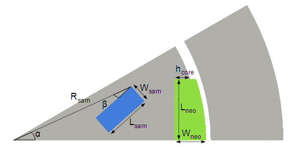
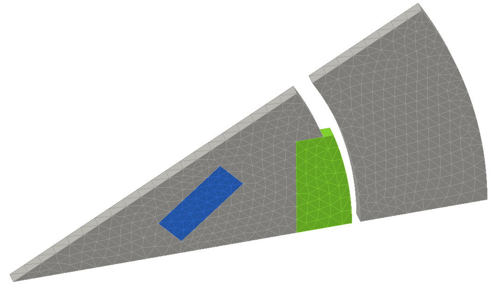
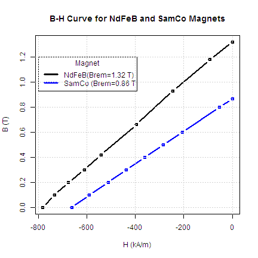
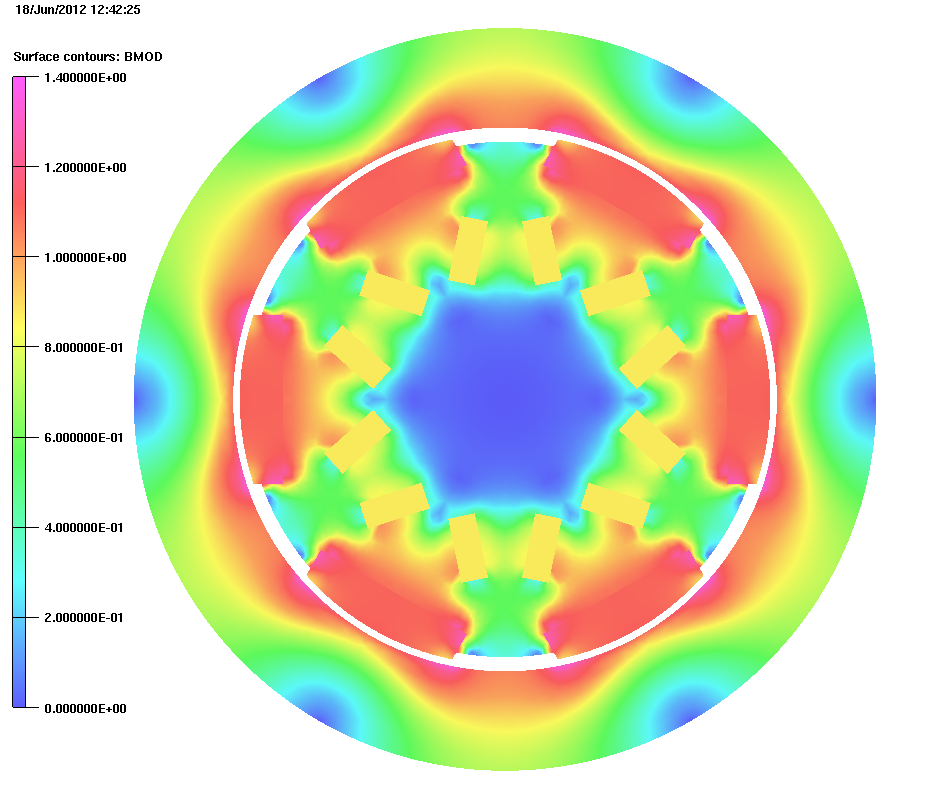
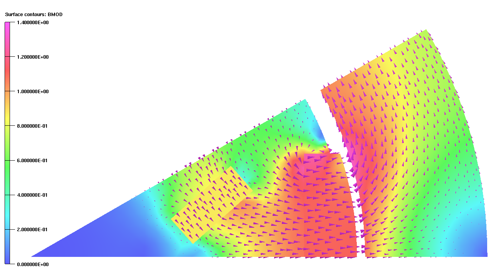
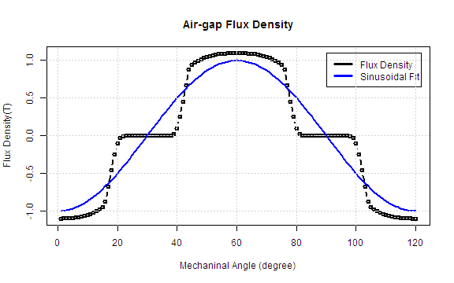
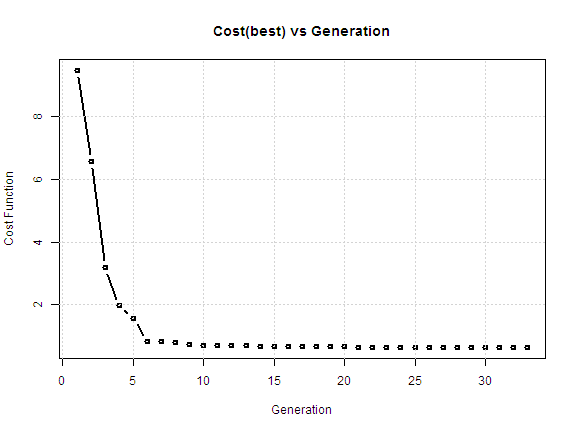

FEA Optimization of a Hybrid PM machine
==================================
**20/06/2012**
**Ozan Keysan**

Summary
------------
An evolutionary optimization tool is developed for FEA problems. The optimization algorithm is flexible and can be easily applied to any electromagnetic finite-element problem. A hybrid PM machine that uses Samarium-Cobalt(Sm-Co) and Neodymium Iron (NdFeB) magnets is used as a test problem. 

Introduction
-------------
Rare-earth PM magnet(e.g. NdFeB) machines are becoming increasingly popular. NdFeB magnets are powerful, but they are expensive. Sm-Co magnets are not as powerful as NdFeB magnets but much cheaper. Sm-Co magnets are usually used in "flux concentrator"" configuration to increase the air-gap flux density. 

A hybrid machine that uses both NdFeB and Sm-Co magnets may reduce the cost of the machine. The analytical modelling of such a machine is difficult due to high degrees-of-freedom of the magnets and the magnetic saturation of iron-core. The electromagnetic performance of the machine can be easily calculated using Finite Element Analysis (FEA).

Hybrid Machine Configuration
------------------------------
NdFeB magnets placed on the rotor surface. Sm-Co magnets are placed inside of the rotor and behaves as flux diverters.

<figure>
  
  <figcaption>Magnet configuration of the hybrid machine</figcaption>
</figure>

3D FEA with Opera
------------------
The machine is modelled with [Opera](http://www.cobham.com/about-cobham/aerospace-and-security/about-us/antenna-systems/kidlington.aspx). The machine has 6 poles. The stator of the machine is modelled as a solid iron but stator slots and armature coils can be added to the model if required. In order to reduce the computational time, the motor is modelled using the half-pole model as shown in the figure below.

<figure>
  
  <figcaption>FEA model inputs (Half-pole symmetry)</figcaption>
</figure>

All the dimensions in the FEA model are parametrized and can be modified according to design requirements. Among these dimensions eight of them are used as input to the optimization algorithm. These are;

* NdFeB Length, Width
* Height of the rotor core
* Sam-Co Length, Width
* Sam-Co Position, Rotation

In this design, it is computationally more efficient to model the machine in 2D, but instead a thin slice of a 3D model is used (see figure below). By this way, it will be possible to use the tool with other 3D optimization problems (e.g. for my PhD). 

<figure>
  
  <figcaption>3D FEA Model of the machine with mesh</figcaption>
</figure>

### Magnet Properties
The B-H curves for the NdFeB and Sam-Co magnets are presented below. The remanence flux densities of NdFeB magnet and Sam-co magnet are 1.32 T, and 0.86 T. 

The price of magnets are assumed as follows;
* NdFeB: £75/kg
* Sam-Co: £15/kg

 

Optimization Tool
--------------------
The optimization algorithm is written with [R](http://www.r-project.org/about.html). R is a programming language and environment (open-source equivalent of Matlab). [Rgenoud](http://sekhon.berkeley.edu/rgenoud/) package is a package of R that solves non-linear optimization problems. Rgenoud combines evolutionary search algorithms with derivative-based (Newton or quasi-Newton) methods to solve difficult optimization problems. It is highly customizable according to the optimization problem.

### Flux Distribution

The input variables proposed by optimization tool are checked for geometrical validity. If the design is valid, the inputs are transferred to Opera 3D and the model is built and flux density distribution is calculated. The FEA takes 10-20 seconds to finish.  The flux density distribution in the machine is presented in the figures below.

<figure>
  
  <figcaption>Flux density magnitude distribution in the machine</figcaption>
</figure>

<figure>
  
  <figcaption>Flux density vectors in the machine</figcaption>
</figure>

After the analysis, the radial flux density distribution is imported into optimization tool. Then, a sinusoidal curve fit is applied on this data to estimate the maximum flux density in the air gap.

 

### Optimization Function

For the hybrid machine the objective is to create maximum flux in the air-gap with the minimum magnet cost.

$$Cost(\vec{x_i})=\sum{Magnet\:Cost}+\sum{Geometry\:Penalty}+Flux\:Penalty $$

* Magnet Cost: Calculated using the specific magnet volume and material price.
* Geometry Penalty: Calculated according to geometrical validity (e.g. overlapping magnets, magnets out of boundaries). The value is zero for a valid design.
* Flux Penalty: Calculated according to the flux density distribution. The value is zero if the flux density is higher than the pre-defined value.

The figure below shows the variation of the cost function over generations. Since, the algorithm also uses derivative information where required, it converges quite quickly (just in 5 generations, N_pop_=60). It takes approximately 4 hours to complete an optimization process with a population of 60 over 30 generations.

 

Capabilities
-------------
* An optimization tool that can be applied to any 3D FEA problem is developed.
* Quick convergence by combining genetic algorithm and derivative information.
* Parallel-computing is possible with R (limited by Opera license).

Things to Do
-------------
### Hybrid PM Machine
* An MSc project proposal?
* Include stator slots and armature coils.
* Fix the dimensions based on a real machine design.
* Modify magnet prices and B-H characteristics.
* Compare cost of a hybrid machine with a NdFeB PM machine.

### Optimization Tool

* Modify the tool for HTS machine optimization.
* Replace Opera with FEMM or other open-source FEA software. An open-source FEA tool enables parallel genetic algorithm optimization which will reduce computation time significantly.
* Parallel optimization support on computer clusters(SEE, Amazon AWS).

